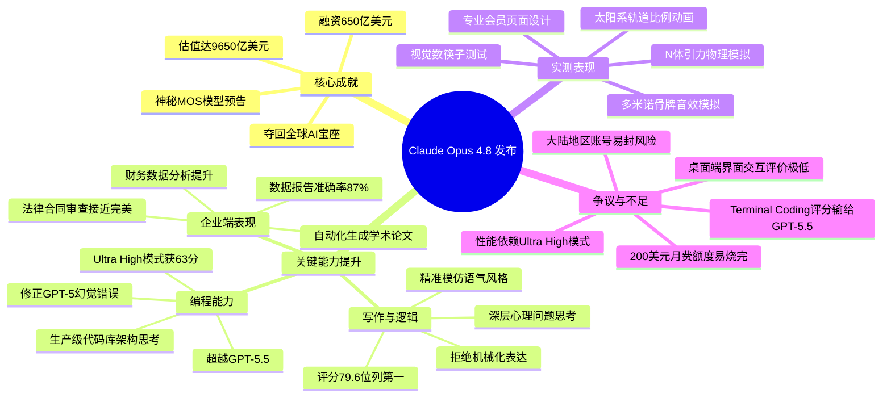

## 图谱（Obsidian 预览中打开）

```mermaid
mindmap
root((Claude Opus 4.8 发布))
  核心成就
    夺回全球AI宝座
    融资650亿美元
    估值达9650亿美元
    神秘MOS模型预告
  关键能力提升
    编程能力
      Ultra High模式获63分
      超越GPT-5.5
      生产级代码库架构思考
      修正GPT-5幻觉错误
    写作与逻辑
      评分79.6位列第一
      精准模仿语气风格
      深层心理问题思考
      拒绝机械化表达
    企业端表现
      数据报告准确率87%
      法律合同审查接近完美
      财务数据分析提升
      自动化生成学术论文
  实测表现
    专业会员页面设计
    太阳系轨道比例动画
    N体引力物理模拟
    多米诺骨牌音效模拟
    视觉数筷子测试
  争议与不足
    性能依赖Ultra High模式
    200美元月费额度易烧完
    桌面端界面交互评价极低
    大陆地区账号易封风险
    Terminal Coding评分输给GPT-5.5
```

## 与 Wiki 的链接

<!-- Stage C 完成后自动补充 wikilinks -->
