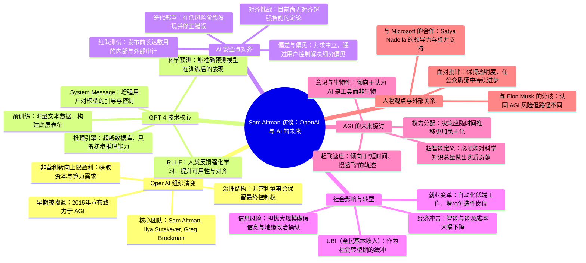

## 图谱（Obsidian 预览中打开）

```mermaid
mindmap
root((Sam Altman 访谈：OpenAI 与 AI 的未来))
  OpenAI 组织演变
    早期被嘲讽：2015年宣布致力于 AGI
    非营利转向上限盈利：获取资本与算力需求
    核心团队：Sam Altman, Ilya Sutskever, Greg Brockman
    治理结构：非营利董事会保留最终控制权
  GPT-4 技术核心
    预训练：海量文本数据，构建底层表征
    RLHF：人类反馈强化学习，提升可用性与对齐
    科学预测：能准确预测模型在训练后的表现
    推理引擎：超越数据库，具备初步推理能力
    System Message：增强用户对模型的引导与控制
  AI 安全与对齐
    红队测试：发布前长达数月的内部与外部审计
    对齐挑战：目前尚无对齐超强智能的定论
    偏差与偏见：力求中立，通过用户控制解决细分偏见
    迭代部署：在低风险阶段发现并修正错误
  社会影响与转型
    经济冲击：智能与能源成本大幅下降
    就业变革：自动化低端工作，增强创造性岗位
    UBI（全民基本收入）：作为社会转型期的缓冲
    信息风险：担忧大规模虚假信息与地缘政治操纵
  AGI 的未来探讨
    起飞速度：倾向于“短时间、慢起飞”的轨迹
    超智能定义：必须能对科学知识总量做出实质贡献
    意识与生物性：倾向于认为 AI 是工具而非生物
    权力分配：决策应随时间推移更加民主化
  人物观点与外部关系
    与 Elon Musk 的分歧：认同 AGI 风险但路径不同
    与 Microsoft 的合作：Satya Nadella 的领导力与算力支持
    面对批评：保持透明度，在公众质疑中持续进步
```

## 与 Wiki 的链接

<!-- Stage C 完成后自动补充 wikilinks -->
